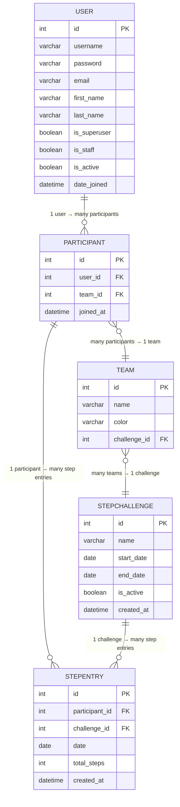

# 🏃‍♂️ Step Challenges App

A Django web application that allows teams and participants to compete in step-count challenges. Participants log their **total steps so far**, and the app provides live leaderboards, progress tracking, and recent activity.

Built as a friendly, lightweight challenge platform with a clean UI and simple data model.

---

## ✨ Features

- ✅ Create and manage step challenges
- 👥 Participants join teams within a challenge
- 📈 Participants log **cumulative step totals**
- 🏆 Mini leaderboards:
  - Top teams
  - Top participants
- ⏱ Challenge progress tracking (days elapsed / remaining)
- 🧠 Smart aggregation logic:
  - Uses each participant's **latest total_steps** entry
  - Team totals are computed as the **sum of latest steps of all team members**
- 🧪 Automated tests for critical edge cases
- 🎨 Responsive, card-based UI


---

## 🧱 Tech Stack

- **Backend**: Python, Django
- **Frontend**: Python, Django Templates + Bulma CSS
- **Database**: SQLite (locally), PostgreSQL
- **Auth**: Django authentication system

---

## 🚀 Getting Started

### 1️⃣ Clone the repository
```bash
git clone https://github.com/elliecdev/step_challenges.git
cd step_challenges
```

---

### 2️⃣ Create and activate a virtual environment

    python -m venv venv
    source venv/bin/activate  # macOS / Linux
    venv\Scripts\activate     # Windows

---

### 3️⃣ Install dependencies

    pip install -r requirements.txt

---

### 4️⃣ Run migrations

    python manage.py migrate

---

### 5️⃣ Create a superuser

    python manage.py createsuperuser

---

### 6️⃣ Start the development server

    python manage.py runserver

Visit:
- App: http://localhost:8000/
- Admin: http://localhost:8000/admin/

---

## 🧪 Running Tests

Run all tests for the `steps` app:

    python manage.py test steps.tests

Tests include:
- Home view context integrity
- Challenge timing calculations
- Leaderboard aggregation correctness
- Regression tests for known bugs

---

## 📊 Step Entry Logic (Important)

Participants **do not log daily deltas**.  

Instead:

- Each entry represents **total cumulative steps so far** for that participant.
- **Participant leaderboard**: shows each participant’s **latest `total_steps` entry**.
- **Team leaderboard**: sums the **latest `total_steps` of all participants assigned to the team**.

This prevents double-counting and ensures rankings reflect the most recent progress of each participant and team.


---

## 🗂 Project Structure (Simplified)

    steps/
    ├── models.py
    ├── views.py
    ├── urls.py
    ├── tests/
    │   └── test_home_view.py
    ├── templates/
    │   └── steps/
    │       └── home.html

---

## Data Model

### Relationship Diagram (Textual)
    StepChallenge
    ├── 1:N Teams
    │      └── 1:N Participants
    │                      |
    └──1:N StepEntries     └── 1:N StepEntries


### 🖼 Visual Data Model (Mermaid)

User is Django's built-in auth_user table



## 🧭 Roadmap / Ideas

- ⏳ Historical progress charts
- 🏅 Badges & achievements
- 🌍 Internationalization (EN / FR)
- 📱 Mobile-first UI refinements

---

## 🤝 Contributing

Contributions are welcome!

1. Fork the repository
2. Create a feature branch
3. Add tests for new behavior
4. Open a pull request

---

## 📄 License

This project is provided for learning and internal use.

---

## 🙌 Acknowledgements

Built with Django, focusing on:
- Correct data modeling
- Clear business logic
- Long-term maintainability
